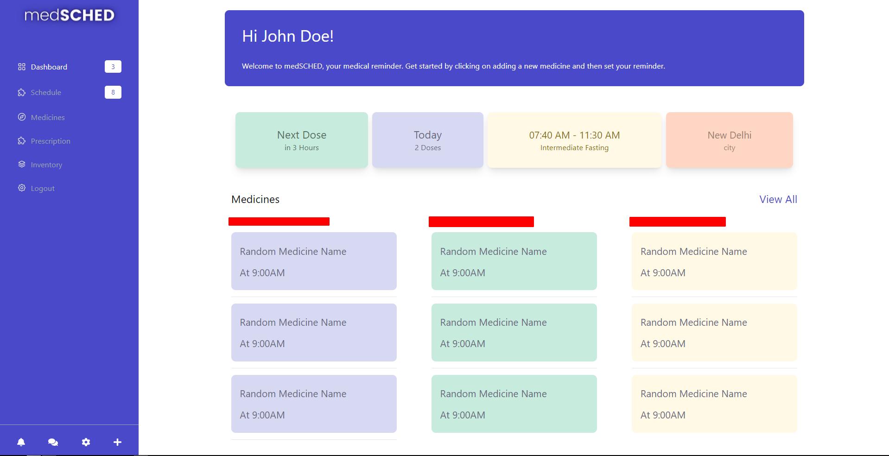
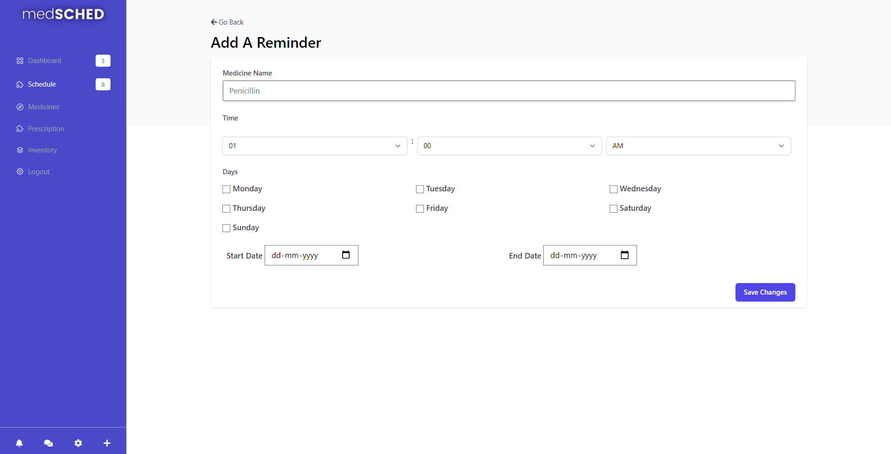
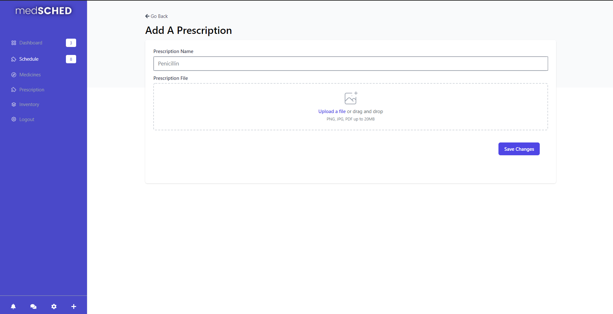

# medSched


medSCHED is an all-in-one application for all of your medical needs. At its core, it is a scheduler and a reminder app for your medicines, that is, it reminds you whenever you need to take a certain pill. It is especially aimed for those, who have trouble remembering or are too busy with their own schedule that they do not keep track of time. 

Another area where medSCHED will be helping people with is its own in-built mini DMS (Document Management System) for all of your prescriptions. You can easily store all of prescriptions at a single place for accessibility and quick reference. With a simplified UI, it is targetted for senior people and for home usage.

medSCHED also comes with a web-scraper which would also show you related information about the medicine by searching on trusted sources making recongition of medicines way easier.

# Installation

In case you want to run a development server on your local machine, then follow the following steps.

### Get the repository

Clone the repository

```
git clone https://github.com/BVNCodeTech/medsched.git

cd medsched
```

### Installing Virtual Environment

Be sure to have python >=3.6 installed in your machine and added to `$PATH` for *nix and to `environment variables` in Windows. Next create a virtual environment by installing and using `virtualenv`

```
pip install virtualenv
```

And then create a virtual environment

```
virtualenv somerandomname
```

Finally, activate the env

```
source somerandomname/bin/activate #For mac os and linux

somerandomname\Scripts\activate #For Windows; use backslash
```

### Installing Requirements

Use pip to install all the modules and libraries required for medSCHED in the required.txt

```
pip install -r requirements.txt
```

Install postcss and tailwind using npm.
```
npm install postcss -D tailwindcss@latest postcss@latest autoprefixer@latest @fortawesome/fontawesome-free

npm install @tailwindcss/forms
```

### Run Flask Server

Before running make sure that port 5000 is free or you can use any other port by passing the `port number` in the run function. You can start the development server like so

```
python3 main.py # For nix

python main.py # For Windows
```

# Screencasts


The Dashboard


Adding A Reminder


Uploading prescriptions

# Contributing 

Please check CONTRIBUTING.md for relevent information
